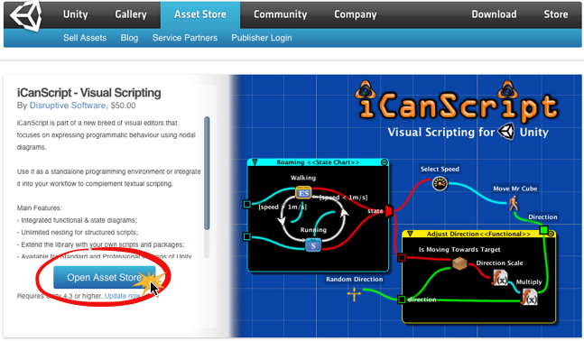
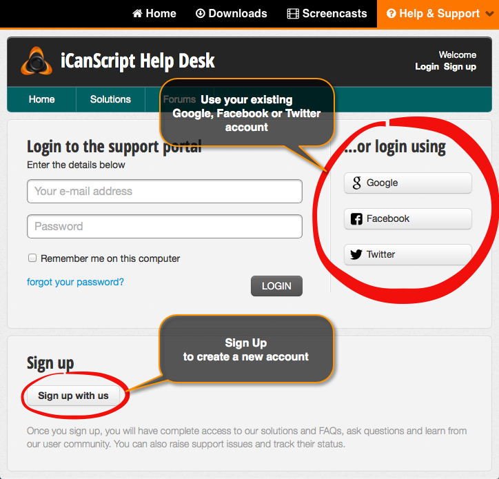
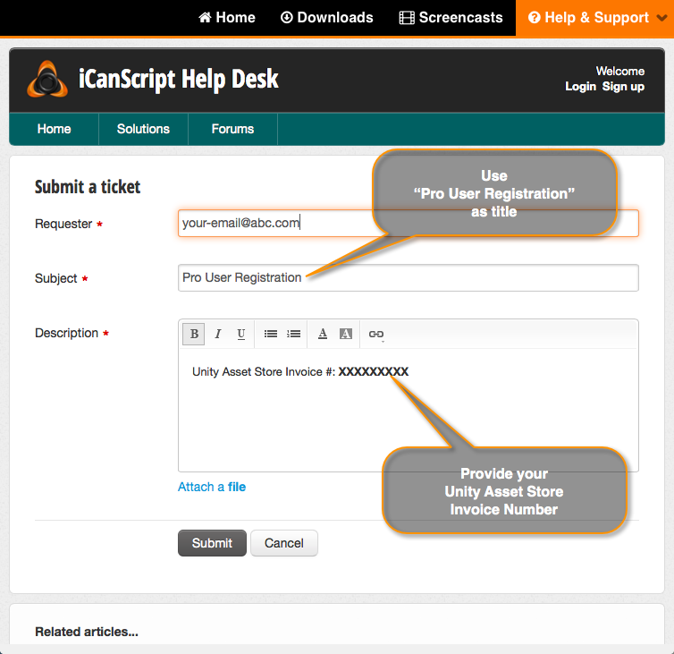

Author: Michel Launier
Date: 2014-08-07
Title: Premium Support -- Pro Users
Keywords: iCanScript Professional Edition, Premium Support, Unity Package

iCanScript Professional clients are:

- prioritized for tickets and feature requests;
- granted access to the latest official Professional edition from the [Solutions page][];
- granted access to the latest development releases (beta) from the [Solutions page][];

> **Note:** Users that have purchased iCanScript from the Unity Asset Store are eligible for premium support.

You need to complete the following steps to obtain premium support:

# 1- Purchase iCanScript from the Unity Asset Store

The professional edition of iCanScript can be purchased from the [Unity Asset Store](http://u3d.as/content/disruptive-software/i-can-script-visual-scripting).

-------------------------------------------------

# 2- Signup on the iCanScript Help Desk #

Creating a user account can be realized in one of the following:

- Use your standard Google, Facebook, or Twitter login;
- Signup with a unique user name & password combination.

-------------------------------------------------

# 3- Provide Your Unity Asset Store Invoice Number #

**Note:** Unity does not provide information to the publisher (us) regarding your purchase.  Verification for the publisher is done by asking Unity for a confirmation of the purchase using the _Unity Asset Store Invoice Number_.

Create a ticket to register:

- Title: _**Pro User Registration**_
- Subject: _**Unity Asset Store Invoice #: XXXXXXX**_

[Solutions page]: (http://icanscript.com/helpdesk/index.html)