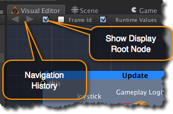
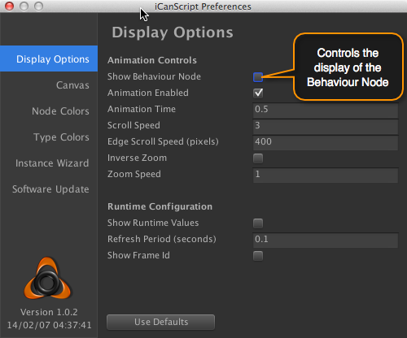
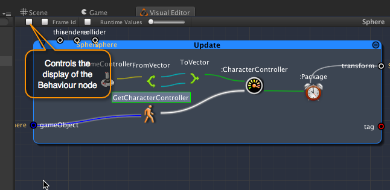
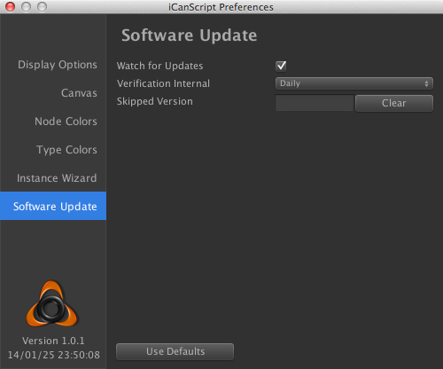

Title: iCanScript Release Notes
Author: Michel Launier
Version: v2.0.0
CSS: Github.css

#  iCanScript Release Notes [Back to top]

<!-- PDF: <<[front-matter/pdf.md] -->
<!-- HTML: <<[front-matter/html.md] -->

## iCanScript v2.0.0 ##
 April 13th, 2015

| Title 1	| Title 2	|  
| :---:	| :---:	|  
| 2	| 3	|  
| 4	| 5	|  

- [X] github boxes
- [ ] Not checked.

 
## iCanScript v1.2.9 ##

_March 24, 2015_

V1.2.9 is a minor bug fix and UX improvement release.

### Features & Improvements ###

- **\[IMPROVED\]** Default canvas colors are softer providing better overall contrast.
- **\[IMPROVED\]** The display of node & port names are nicefied to improve readability.
- **\[IMPROVED\]** Display of port values has been removed in editor if port is connected to another port also shows the value.

### Unity 5 - Known Issues ###

Unity 5 changes many interfaces and the way the index for its help file is generated.  This, with the fact that it is still in beta, does create some issues for visual scripts created with prior versions of Unity.  We will work out the remain issues as Unity 5 stabilizes and is rolled out to the general public.

- **\[ISSUE - Unity 5\]** No anti-aliasing for bindings that connect nodes.  The root cause is being investigated.
- **\[ISSUE - Unity 5\]** No help description for UnityEngine nodes.  The help file format for Unity 5 has changed.  Support will be added in future release.  Please refer to the Unity 5 scripting help for now.
- **\[ISSUE - Unity 5\]** Unity 5 has removed direct access to _GameObject Components_ and requires the use of the _GetComponent(type)_ function.  Visual Script create with previous version of Unity need to adopt the new Unity 5 interface.  These changes are backward compatible with Unity 4.
- **\[ISSUE - Unity 5\]** Unity v5.0.0f2 has minor corruption in its reflection database resulting in misbehaviour for a small number of UnityEngine functions.  An example of this is the function "Random.insideUnitSphere" function that cannot be invoked from the reflection database.  A new version of Unity is required to solve this issue.

* * *

## iCanScript v1.2.8 ##

_March 24, 2015_

V1.2.8 is a minor bug fix release.

- **\[FIX\]** Allow Color fields to be edited from the inspector.

### Unity 5 - Known Issues ###

Unity 5 changes many interfaces and the way the index for its help file is generated.  This, with the fact that it is still in beta, does create some issues for visual scripts created with prior versions of Unity.  We will work out the remain issues as Unity 5 stabilizes and is rolled out to the general public.

- **\[ISSUE - Unity 5\]** No anti-aliasing for bindings that connect nodes.  The root cause is being investigated.
- **\[ISSUE - Unity 5\]** No help description for UnityEngine nodes.  The help file format for Unity 5 has changed.  Support will be added in future release.  Please refer to the Unity 5 scripting help for now.
- **\[ISSUE - Unity 5\]** Unity 5 has removed direct access to _GameObject Components_ and requires the use of the _GetComponent(type)_ function.  Visual Script create with previous version of Unity need to adopt the new Unity 5 interface.  These changes are backward compatible with Unity 4.
- **\[ISSUE - Unity 5\]** Unity v5.0.0f2 has minor corruption in its reflection database resulting in misbehaviour for a small number of UnityEngine functions.  An example of this is the function "Random.insideUnitSphere" function that cannot be invoked from the reflection database.  A new version of Unity is required to solve this issue.

* * *

## iCanScript v1.2.7 ##
_February 28, 2015_

V1.2.7 fixes issues, improves the multi-selection feature and supports Unity 5.  In addition, the library search has been improved with fuzzy search capabilities.

### Features & Improvements ###

- **\[NEW\]** Unity 5 support.  See [Unity 5 - Known Issues] for details.
- **\[NEW\]** Support relocating a multi-selected group of nodes to a new parent.
 - **\[IMPROVEMENT\]** You can now search the library with _fuzzy_ search strings.  For example, searching for _"v3"_ will find _"Vector3"_ & _"Vertex3"_.
- **\[IMPROVEMENT\]** Removing _red_ as the default color for _bool_ and _string_ types.  Now the default colors for _bool_ and _string_ are white and orange respectively.

### Bug Fixes ###

- **\[FIX\]** Fix issue where changing an array in the inspector would not be preserved.
- **\[FIX\]** Maintain node multi-selection when clicking on an already selected node.
- **\[FIX\]** Multi-Selection now functional on Windows.
- **\[FIX\]** Null Exception when editing visual script snippets.
- **\[FIX\]** Warning generated when compiling state chart & state nodes with data ports.

### Unity 5 - Known Issues ###

Unity 5 changes many interfaces and the way the index for its help file is generated.  This, with the fact that it is still in beta, does create some issues for visual scripts created with prior versions of Unity.  We will work out the remain issues as Unity 5 stabilizes and is rolled out to the general public.

- **\[ISSUE - Unity 5\]** No anti-aliasing for bindings that connect nodes.  The root cause is being investigated.
- **\[ISSUE - Unity 5\]** No help description for UnityEngine nodes.  The help file format for Unity 5 has changed.  Support will be added in future release.  Please refer to the Unity 5 scripting help for now.
- **\[ISSUE - Unity 5\]** Unity 5 has removed direct access to _GameObject Components_ and requires the use of the _GetComponent(type)_ function.  Visual Script create with previous version of Unity need to adopt the new Unity 5 interface.  These changes are backward compatible with Unity 4.
- **\[ISSUE - Unity 5\]** Unity v5.0.0f2 has minor corruption in its reflection database resulting in misbehaviour for a small number of UnityEngine functions.  An example of this is the function "Random.insideUnitSphere" function that cannot be invoked from the reflection database.  A new version of Unity is required to solve this issue.

* * *

## iCanScript v1.2.6 ##
_January 30, 2015_

V1.2.6 is a bug fix & library layout improvement release.

### Features & Improvements ###

 - **Library Prototype Info:** The full signature of each node is now available in the library panel.
- **Tips & Tricks Projects:** A new section in the _Demo Scenes_ was added to contain the _tips & tricks_ scenes.
- **Circular Dependency Resolution:** The iCanScript engine deadlock resolution is improved resulting in a more stable execution when multiple inter-related circular dependencies exist.

### Bug Fixes ###

- **Multiplexer Port Binding:** Fix issue preventing the addition of input bindings for multiplexer ports.
-  **Multiplexer Port Execution:** Fix error thrown by multiplexer port when running the engine.
-  **Public Functions/Variables:** Fix error indication improperly showing for type mismatch of public variables & functions.
-  **Help & Tip Box:** Fix refresh problem with the editor window help & tip boxes.

* * *

## iCanScript v1.2.5 ##
_December 16, 2014_

V1.2.5 is an improvement & bug fix release. 

### Features & Improvements ###

- **Performance Improvement:** Significant reduced processing by Visual Editor.
- **Disabling Help Box:** Clicking the '?' Hot Zone of the Help Box always disables it.
- **InvokeVisualScript("functionName"):** The Behaviour & Visual Script now support the function _InvokeVisualScript(string publicFunctionName)_ to invoke a port less public function from an external application such as the Unity 4.6 UI.
- **.NET Library:** Added _Int32_ & _float_ type functionality in _.NET System_ library.
- **.NET Library:** Added _Directory_ & _File_ classes from the _.NET System_ library.
- **Start/End of Line:** The start/end of line keys are now available when editing a port value inside the graph.

### Bug Fixes ###

- **Play:**  The community limit warning has been removed when the game is playing.
- **Function Call Compile Error:** iCanScript now compiles all situations where function definition & function call is part of the same visual script.
- **Remove OnRenderImage Message Handler:** The generation of OnRenderImage visual script causes lost of camera in the Pro version of Unity.  This message handler was temporarily removed. 

* * *

## iCanScript v1.2.3 & v1.2.4 ##
_November 14, 2014_

### Features & Improvements ###
#### Workflow Assistant & Help Box ####
- Addition of a _**Workflow Assistant**_ to help guide first time users.
- Addition of a _**Help Box**_ that displays the summary information of the node or port under the mouse.
- The hot key _**'H'**_ shows detail help of the selected node in a separate browser window.

#### Public Variables & Public Functions

- **Public  Variables** can now be created by dragging a _*Variable Builder**_ from the Library onto the canvas (top-level) of a _Visual Script_.
- **Public Functions** (i.e.. user defined functions) can now be created on the canvas (top-level).
- Public Variables _**can be referenced**_ by any Visual Script in the scene _(including instantiated Prefabs)_.
- Public Function _**can be invoked**_ by any Visual Script in the scene _(including instantiated Prefabs)_. 

#### Visual Editor ####

- **Data Flow Depiction:** Arrow on bindings shows direction of data flow.
- **Invisible TypeCast:** Automatically generated _TypeCasts_ no longer appear in the _Visual Editor_ thus reducing the complexity of the _Visual Script_.
- **Value _vs_ Reference Port:** Value and reference ports are now depicted by circles and square respectively.
- **Node Disabled Depiction:** Disable nodes are now greyed out in editor and execution mode.
- **State Charts:**
	- The active state is shown with a green high-light.
	- It is now possible to add _Enable & Trigger_ ports to a State Chart.

#### Library Window
- **UnityEngine Library:** The UnityEngine library is now automatically populated according to the version of Unity used.
- **Library Search:** Library search has been improved with options to:
	- _Show/Hide_ inherited functions & variables;
	- Select to search within one or a combination of _classes/functions/variables_.

#### Unity Hierarchy
- **Logo in Unity Hierarchy:** The iCanScript logo is displayed in the hierarchy for game objects containing a visual script.

### Node Library Changes ###
- **NavMesh:** Unity NavMesh functionality has been added to the node library.
- **TypeCasts:** TypeCasts arena longer required and have been removed from the library.
- **GameController:** The non-configurable _GameController_ has been removed in favour of the larger configurable and input complete _GameController_.

### Bug Fixes ###
- **State Chart:** Child _Entry State_ was not ran when the transition targeted the parent state.
- **Relocation of Transition Ports:** Transition ports cannot be relocated to a different edge on the state node.
- **Initial Value for Copy-Drag:** Initial port values referencing Unity objects were not copied when using node copy-drag.
- **Library:** The help box showing the port information is displayed when hovering the _Library Window_ even if the help box has been disabled.
- **Visual Editor & Library:** The Visual Editor & Library Window can now be resized when not docked.
- _... Many minor bug fixes._
 
### Known Issues ###
- **Multi-Select on Windows:** Multi-Select is non-functional on the Windows platform.

* * *

## iCanScript v1.2.2 ##

_September 16, 2014_

### Bug Fixes ###
- **_Shift-F_ on Windows:** Fix _Shift-F_ key not working in Unity on the Windows platform.
- **Instance Wizard:** The Instance Wizard remains in focus when selecting a port on the instance node.
- **Iconize Position:** The node is no longer relocated when changing its iconic texture.
- **Initial State Chart Position:** The _State Chart_ initial position is now properly set to be centred at the cursor position.

### Features & Improvements ###
- **Node/Port Name Edition:**  It is now possible to edit the name of nodes and ports directly from within the visual editor.
- **Unwrap Package:** In contextual menu, the _Delete Keeping Children_ menu item has been renamed _Unwrap Package_ to improve consistency with the _Wrap in Package_ menu.
- - **Iconic Texture:** The iconic texture of a node is scaled down to 64x64px if it is imported at a larger size.
- **Improved Layout:** Better layout when adding new nodes to the visual script.

### Node Library Changes ###
- **[NEW] SendMessageUsingTag:** The _RemoteCall_ library has been augmented with _SendMessageUsingTag_ to simplify the frequently used _FindObjectWithTag_ and _SendMessage_ combo.
- **[NEW] Timer:** A new _Timer_ library has been added for simple _StartTimer_ and _isElapsed_ type of behaviour.
- **[OBSOLETED] Accumulators:** The accumulators nodes have been obsoleted and should be replaced by the _Variable_ nodes.

### Space Shooter Tutorial
The popular Unity Space Shooter tutorial was recreated using iCanScript.

Use the following links to download the Space Shooter project and watch the video tutorials:

- [Space Shooter Package](http://www.icanscript.com/downloads)
- [Space Shooter Video Tutorials](http://www.icanscript.com/Learn2)

* * *

## iCanScript v1.2.1 ##

_August 19, 2014_

 

### Node Library Incompatibility ###
- **GameController:**
	- The GameController does not compensate anymore for the frame rate in it _**analog**_ output;
	- The _**analog**_ output is now the scaled _GetAxis(...)_ only; 
	- Therefore you will need to reconfigure the GameController scale input (typically dividing its value by 60.)
 

### Features & Improvements ###
- **Improved Binding Layout:** Connecting two ports does not move the ports or create _"complex curvy"_ bindings.

### Bug Fixes ###
- **Error Messages:** Fix null exception errors resulting from attempting to save/undo a visual script that is no longer focused by the _Visual Editor_.
- **Wrong Position of Visual Scripts:** The position of the Visual Script is now properly saved and restored.  The scene must be saved for the initial position to be stored.

* * *
## iCanScript v1.2.0 ##

_August 2nd, 2014_

### Features & Improvements ###
- **Focus Parent Node (Shift-F):**  The hot-key _**Shift-F**_ can now be used to center the visual editor on the parent node of the selected port or node.
- **Focus Visual Script (Ctrl-F):** The hot-key _**Ctrl-F**_ can now be used to center the visual script in the visual editor.
- **Collision Algorithm:** The node collision in the _Visual Editor_ is now more predictable and consistant with the user layout.
- **Drag to Initialize Ports:**  The user can now drag a game object from the hierarchy onto a port to initialize the port with a component of that game object (ex: transform).
- **Conditional Nodes:**  Added conditional nodes for _**int**_ and _**string**_ types.
- **Boolean Choice Node:** Added a Boolean choice node to help initialize boolean logic.
- **Library Search Performance:** Library search performance has been significantly improved when generating a large result set.
- **Multiplexer Port Creation:** Creating a multiplexer port now requires the _**Ctrl-Key**_ to be depressed when creating the binding.  This feature reduces accidental multiplexer port creation.
- **User Defined Functions:** Parameterless user defined functions can now be created at the top-level of the visual script (Behaviour) using the contextual menu or by dragging an existing package.

### Bug Fixes ###
- **Build Errors:** iCanScript texture errors when building the player are now resolved.
- **Renaming Message Handler:** Renaming of the _MessageHandler_ node caused a breakage between the Unity _message_ and the iCanScript _MessageHandler_ node.  Renaming of _MessageHandler_ nodes is not permitted anymore.
- **Invalid Instance Node Creation:** Invalid creation of an _Instance Node_ from an input port is not permitted anymore.
- **Disallow Modifications when engine is Playing:**  Structural modifications are now rejected when the engine is playing.
- **Undo for labels:** Node and port label change can now be undone.
- **Undo for values:** Port static value change can now be undone.
- **Layout:** Improved stability in visual script layout.
- _**Many minor bug fixes...**_

* * *

## iCanScript v1.1.3 ##

_June 20, 2014_

### Features & Improvements ###
- **Notification: No Visual Script Selected:**  The _**visual editor**_ and _**tree view**_ now display a notification when the selected _GameObject_ does not include a visual script component.
- **Update Message Handler:** The "Update" message handler is created by default when a new visual script is installed on a GameObject.

### Bug Fixes ###

- **iCanScript Gizmo:** The iCanScript gizmo is once more visible on the game objects in the scene view.
- **Visual Script Prefabs:** The visual script prefabs are back.
	- Creating a Prefab from a game object with a visual script allows to share the visual script on multiple object in the scene.
- **Visual Script Snippets:** Dragging a node inside the project using _**Shift-Drag**_ creates a visual script snippet Prefab:
	- Create a collection of pre-built visual script packages;
	- Dragging the visual script snippet into a visual script editor will copy the snippet at the drag release point.
- **Library Search:** The library search can now find classes by name.
- **Runtime Values:** Value change on package ports performed at runtime is now properly reflected.
- **Double-Click:** Double-click to expand nodes properly performs on slow computers.

* * *

## iCanScript v1.1.2

_May 21, 2014_

iCanScript v1.1.2 introduces a new help desk where users can search the knowledge base and participate in the community forums.

The demo edition of this release now includes a limited trial period allowing customers to try the product before making a purchase decision.  The trial version can be downloaded from the product [website](www.icanscript.com).

### Features & Improvements
- **About Dialog:** Details pertaining the product is available from the menu item _**Help->iCanScript->About...**_
	- product version;
	- product edition;
	- user license.
- **Help desk:** The new and greatly awaited help desk is now online:
	- Ticket submission & tracking;
	- Knowledge Base;
	- Community forum.
- **Purchase option (demo edition only):** Users of the demo edition can now purchase the product directly from the menu item _**Help->iCanScript->Purchase...**_

### Bug Fixes ###

- No change in this release.

### Known Bugs
- **Performance Glitches:** Having the _Transform_ displayed in the inspector when playing a visual script can cause some performance glitches.  Please fold the _Transform_ if you find that the execution is jerky.

### Demos & Tutorials
- No change in this release.

* * *

## iCanScript v1.1.1 (Beta #20)

_April 11th, 2014_

iCanScript v1.1.1 is a Unity Asset Store submission release.  It includes some minor bug fixes and embellishments.

### Features & Improvements  
- **Automatic Layout of Bindings:** Pressing the _**'L'**_ key automatically relayout the bindings connected to the _selected_ port.

### Bug Fixes
- **Inspector Refresh:** The inspector window is now immediately refreshed when selecting a node or port.
- **Display Root Position:** Resolve problem were display root node position changes in the parent node when display root child nodes are moved or folded/unfolded/iconized.
- **Navigation & Undo/Redo:** The Undo/Redo will not always change the Visual Editor viewport to display root node of the Undo/Redo.  Note that the Undo/Redo is functional and note affected by this problem.

### Known Bugs
- **Performance Glitches:** Having the _Transform_ displayed in the inspector when playing a visual script can cause some performance glitches.  Please fold the _Transform_ if you find that the execution is jerky.

### Demos & Tutorials
- No change in this release.

* * *

## iCanScript v1.1.0 (Beta #19)

_April 2nd, 2014_

iCanScript v1.1.0 resolve the Undo/Redo problems and adds the Visual Script navigation feature.

### Important Notice! ###

The correction of a serious bug related to Undo/Redo forced a significant change in the way iCanScript stores its visual script.  Consequently, version v1.1.0 of iCanScript is not backwards compatible.  Please contact [support](mailto:support@disruptive-sw.com) if you need help porting existing visual scripts to this new version.

**P.S.** iCanScript now includes a _textual_ Export/Import feature to avoid future data incompatibilities.

### Features & Improvements  
- **Visual Script Navigation:** It is now possible to navigate the visual scripts by changing the root node to be displayed in the visual editor viewport:
	- _**Ctrl-Double Click**_ (or Ctrl-Enter) on a child node to set the new display root node;
	- _**Ctrl-Double Click**_ (or Ctrl-Enter) on the display root node reverts to the previous display root node.
	- Changing the display root node is also possible from the contextual menu.
- **Navigation History:** Backward and Forward navigation of display root nodes is available.
	- Press _**'['**_ to move back in the history;
	- press _**']'**_ to move forward in the history;
	- Navigation arrows are also available in the visual editor toolbar.
- **Show Display Root Node:** The display of the root node can be controlled using the left most _'checkbox'_ in the visual editor toolbar.  (Note that the display of the child nodes is not affected by this configuration.)
	- Disable the display of the root node for increased freedom when editing the nested visual script;
	- Enable the display of the root node to create a public interface for the root node (i.e. publish ports to the root node).
- **Export/Import:** The visual script can now be exported and reimported using a JSON textual representation.

### Bug Fixes
- **Undo/Redo:** The Undo/Redo functionality is now fully operational.  It is compatible with all versions of Unity.

### Known Bugs
- **Navigation & Undo/Redo:** The Undo/Redo will not always change the Visual Editor viewport to display root node of the Undo/Redo.  Note that the Undo/Redo is functional and note affected by this problem.
- **Performance Glitches:** Having the _Transform_ displayed in the inspector when playing a visual script can cause some performance glitches.  Please fold the _Transform_ if you find that the execution is jerky.

### Demos & Tutorials
- No change in this release.

* * *

## iCanScript v1.0.4 (Beta #18)

_March 10th, 2014_

iCanScript v1.0.4 improves detection of errors/warnings when compiling the visual scripts.

### Known Bugs
- **Undo / Redo:** Unity version 4.3.2f1 has a nasty bug with its Undo feature.  The operations that are affected by this bug are those that involves mouse drag (in fact any operations that generates multiple internal UI events).  Beware that we are following the evolution of this bug and will make any necessary adjustments once Unity has corrected the issue.
- **Performance Glitches:** Having the _Transform_ displayed in the inspector when playing a visual script can cause some performance glitches.  Please fold the _Transform_ if you find that the execution is jerky.

### Bug Fixes
- **Compilation:** Errors generated while compiling now aborts the execution of the script.
- **Compilation:** An error is now raised when the code for a node can't be generated due to removing a library or changing type name.

### Features & Improvements  
- No change in this release.

### Demos & Tutorials
- No change in this release.

* * *

## iCanScript v1.0.3 (Beta #17)

_March 1st, 2014_

iCanScript v1.0.3 corrects a major issue when running the included Playground demo scenes.

### Known Bugs
- **Undo / Redo:** Unity version 4.3.2f1 has a nasty bug with its Undo feature.  The operations that are affected by this bug are those that involves mouse drag (in fact any operations that generates multiple internal UI events).  Beware that we are following the evolution of this bug and will make any necessary adjustments once Unity has corrected the issue.
- **Performance Glitches:** Having the _Transform_ displayed in the inspector when playing a visual script can cause some performance glitches.  Please fold the _Transform_ if you find that the execution is jerky.

### Bug Fixes  
- **Playground Demo:** Playground demo is now playable.
- **Visual Editor:** Embedded nodes are now displayed when performing Copy-Drag (Ctrl+drag).
- **General:** Remove extraneous display logs when dragging nodes.

### Features & Improvements  
- No change in this release.

### Demos & Tutorials
- **Playground Demo:** Fix warnings & errors when executing the playground demo.

* * *

## iCanScript v1.0.2 (Beta #16)

_Feb 5th, 2014_

iCanScript v1.0.2 includes a full review of the visual editor animations and several corrections in its Undo / Redo features.  In addition, this version adds the following two cool features:

- Multi-Selection and;
- Contextual Menu for Port Drag & Release.

Read-on for aditional details.

Enjoy !!!

### Known Bugs
- **Undo / Redo:** Unity version 4.3.2f1 has a nasty bug with its Undo feature.  The operations that are affected by this bug are those that invloves mouse drag (in fact any operations that generates multiple internal UI events).  Beware that we are following the evolution of this bug and will make any necessary adjustments once Unity has corrected the issue.
- **Performance Glishes:** Having the _Transform_ displayed in the inspector when playing a visual script can cause some performance glishes.  Please fold the _Transform_ if you find that the execution is jerky.

### Features & Improvements
- **Multi-Selection:** Hold down the Command/Windows key to select multiple nodes & ports.  Multi-Selection can be used to:
	- Delete a group of nodes / ports;
	- Warp a selection in a package;
	- Drag multipple nodes to a new location.
- **Contextual Menu for Port Drag & Release:** A contextual menu is available when you drag and release a data or control port in an empty area of a package node.  The menu gives you the ability to create nodes and automatically bind them to the dragged port.
-  **Node Library:** All _"FromVector"_ and _"ToVector"_ have be relocated under a new iCanScript Library named _"From <-> To"_.
- **Wrap in Package:** You can now wrap the selected node(s) in a package using the contextual menu or using the 'W' key shortcut.
- **Delete Package Keep Children:** You can now delete a package and promote the children nodes to the parent package.
-  **Display of Behaviour Node:** The display of the Behaviour node can now be disabled using the Preferences Panel or the checkbox on the left of the visual editor toolbar.

### Bug Fixes:
- **Message Node:** Fix message handler warnings/errors when playing the game.
- **Port Relocation:** Fix problem where dragging port on edge of same parent would cause an illegal circular connection.
- **Contextual Menu for OnEntry, OnUpdate, OnExit:** A contextual menu is now available for the state node _OnEntry_, _OnUpdate_, and _OnExit_ packages.
- **Undo/Redo:** All undo/redo were revised and corrected. (see known bug above for details).

### Demos & Tutorials:
- No change in this release.

* * *

## iCanScript v1.0.1 (Beta #15)

_Feb 3rd, 2014_

iCanScript v1.0.1 is the 2nd release in preparation for submission to the Unity Asset Store.  This release includes corrections for critical bug in editing state charts and code generation.  The software upgrade feature as also been improved.

Enjoy !!!

### Features & Improvements:
- **Build Date:**  The build date is displayed below the version information in the Preferences Panel.
- **Property Port Name:** Property output port is now named with the property name.
- **Periodic Check for Update:**
	- Periodically verifies for newer versions of iCanScript.
	- The interval can be adjusted from the _Preferences Panel_.

### Bug Fixes:

- **State Chart:** Fixes crash when binding the _"Transition Package trigger port"_ while it is already bounded.
- **Re-parenting Node:** Fix broken binding when re-parenting a node with a circular connection (output port connected to an inout port) and a connection to another node from the same output port.
- **Code Generation:** Fix _Package_ code generation issue resulting in ports not being created with the proper internal _"index"_.
- **Transition Node:** The name of _Transition Node_ can now be edited.

### Demos & Tutorials:

- **Playground:** A mini-playground demo has been added to the Demo_Scenes folder.  This demo consists of a rolling ball that can be controlled by user input.

[Back to top][]

* * *

## iCanScript v1.0.0 (Beta #14)

_Jan 23, 2014_

iCanScript v1.0.0 (Beta #14) is the first release that complies with the Unity Asset Store requirements.  It includes:

- menu re-organization;
- documentation distribution;
- a Quick Start demo scene; and...
- bug fixes.

###  Unity Asset Store Required Changes
- **Menus:**  The items in the top-level *iCanScript* menu were relocated as follows:

| Menus Items (before v1.0.0)	| Relocated Menu Items (v1.0.0)	|  
| :-------------	| :----------------	|  
| _iCanScript->Create Visual Script_	| _Edit->iCanScript->Create Visual Script_	|  
| _iCanScript->Center Visual Script_	| _Edit->iCanScript->Center Visual Script_	|  
| _iCanScript->Center on Selected_	| _Edit->iCanScript->Center on Selected_	|  
| _iCanScript->Home Page_	| _Help->iCanScript->Home Page_	|  
| _iCanScript->User Guide_	| _Help->iCanScript->User Guide_	|  
| _iCanScript->Release Notes_	| _Help->iCanScript->Release Notes_	|  
| _iCanScript->Customer Request_	| _Help->iCanScript->Customer Request_	|  
| _iCanScript->Check for Updates..._	| _Help->iCanScript->Check for Updates..._	|  

- **Documentations:** The following documentation files can be found in the top-level folder of iCanScript:
	- Readme.pdf
	- Release Notes.pdf

- **Demo Scenes:** iCanScript now includes a _Demo_Scenes_ folder.  This folder includes the _Quick Start Tutorial_ scene.  Please refer to the User Guide for detailed explanation in building the Quick Start scene.

### Features & Improvements:

- **State Chart:**  The Transition Package as been significantly simplified.  You can now create the guard condition directly under the transition module.
- **State Chart Icons:** New icons are provided for state _OnEntry_, _OnUpdate_, and _OnExit_ packages.

### Bug Fixes:

- **Engine :: State Chart:** The state chart execution could stall the engine due to improper deadlock resolution.
- **Engine :: State Chart:** The engine code for multiplexer ports on the edge of state chart was not generated causing those ports to stall their output value.

### Known Bugs:

- **State Chart:** Binding the _"Transition Package trigger port"_ while it is already bonded causes the Visual Editor to crash.
	- **Workaround:** Please remove the binding to the trigger port before making a new binding.
- **State Chart:** Multiplexer port on the edge of the chart chart may run out of sequence.
	- **Workaround:** Embed the State Chart inside a Package node and relocate the multiplexer port on the Package will assure proper execution sequence.
	
[Back to top][]

* * *

## iCanScript v0.9.7 (Beta #13)
_Jan 10, 2014_

iCanScript v0.9.7 (Beta #13) is a preparation release for submitting to the Unity Asset Store. It includes a small number of fixes and compatibility adjustment for Unity v4.3.x latest API.

Enjoy !!!

### Bug Fixes:
- **Engine:** Enable Ports sourced from an uninitialized boolean port are enabled by default (they were disabled in the prior versions).

### Features & Improvements:
- Compatibility with v4.3.x of Unity:
	- Support latest Undo API;
	- Support latest Inspector GUI.

[Back to top][]

* * *

						
## iCanScript v0.9.6 (Beta #12)
_Nov 11, 2013_

iCanScript v0.9.6 (Beta #12) is a critical bug fix release for the engine resolving several possible deadlocks for visual scripts with circular dependencies. It also include additional debug capabilities and a minimal node library.

Enjoy !!!

### Bug Fixes:
- **Engine:** Fix deadlock when running with circular dependancies;
- **Engine:** Fix multiplexer port selection when involved in circular dependencies;
- **Library Tree:** Clicking the X icon clear the search string field;

### Features & Improvements:
- **New Nodes in base package:**
	- Accumulators;
	- Boolean Logic;
	- Comparaisons;
	- Choice (selection from 2 inputs);
	- Math (Add, Sub, Mul, Div, Random, FromVector, ToVector).
- **New Debug Capabilities:**
	- Frame Id and Frame Rate shown in visual editor toolbar;
	- Frame Id shown on each node when running (configurable);
	- Display of Frame Id on nodes can be enabled/disabled from Preference Panel and Visual Editor Toolbar.
- **New Package Icons:** A package icon is displayed for utility types (static classes).
- **Automatic Object Creation:** A variable of the proper type is created for nodes that require an object instance (i.e. This) but does not have one defined.

[Back to top][]

* * *

## iCanScript v0.9.5 (Beta #11)
iCanScript v0.9.5 (Beta #11) is a bug fix release.

Enjoy !!!

### Bug Fixes:
- **Visual Editor:** Data ports do not disappear anymore when creating a binding;
- **Running:** Resolve hang when running with one or more bindings between two or more behaviour message nodes;
- **Running:** Resolve exceptions when compiling/running nodes with a trigger port;
- **Running:** Resolve exceptions when compiling/running nodes with enable port(s);
- **Running:** Resolve exceptions when compiling/running nodes with multiplexer port(s);
- **Running:** Enable ports are now functional when running engine;
- **Running:** Trigger ports are now functional when running engine;
- **Running:** Multiplexer ports are now function when running engine.

[Back to top][]

* * *

## iCanScript v0.9.4 (Beta #10)
iCanScript v0.9.4 (Beta #10) is a bug fix release moving iCanScript closer and closer to stability for the first official release...

Enjoy !!!

### New Features:
Custom Node Installer: Decouple the user node installer from the default iCanScript installer (see User Guide for details).

### Bug Fixes:
iCanScript Menus: Web reference for User Guide and Release Notes are now functional.
Unity 4.2.1 Project Conversion Issue: This release was compiled using v4.2.1 and can be installed on Unity 4.2.x if you find that Unity crashes when converting your projects.

[Back to top][]

* * *

## iCanScript v0.9.3 (Beta #9)
iCanScript v0.9.3 (Beta #9) is the first feature complete release. It includes several new features needed to create game scripts notably support for all Unity Behaviour (MonoBehaviour) messages such as OnTriggerEnter(…), OnCollision(…). RC #1.0a is the base for the upcoming V1.0 release. It departs from the previous release and may not be compatible with project created with previous releases. 

Enjoy !!!

### New Features:
- **All:** Supports all Unity Behaviour Messages.
- **All:** Supports for conditional execution using "Enable" & "Trigger" ports.
- **All:** Support for an output "this" port that can be used on instance nodes to control the execution sequence.
- **Visual Editor:** Support for multiplexer input & output port to merge the data when using conditional execution.
- **Visual Editor:** Display name of game object being edited in the window toolbar.
- **Visual Editor:** Edition of previous visual script when new selected scene object does not include a visual script.
- **Visual Editor:** Ports are now classified has either an end port or a relay port.
- **Visual Editor:** Different icons for input and output ports (in preparation for port on any edge feature).
- **Library Editor:** Icons have been updated to reflect company logos and package grouping.
- **Hierarchy Editor:** Icons are not synchronized with the user defined icons of the nodes.
- **Preference Editor:** Added configurable option for code engineering.
- *… and much much more …*

### Bug Fixes:
- **Library Panel:** Now include public fields, properties, and functions of base classes using the BaseVisibility=true option of the iCS_Class attribute.
- **Visual Editor:** Resolve null exception when starting / stopping game engine.

[Back to top][]

* * *

## iCanScript v0.9.2 (Beta #8)
Release 0.9.2 (Beta #8) of iCanScript is a bug fix release. This release is compatible with projects created in v0.9.1.

Enjoy !!!

### New Features:
- **Visual Editor:** Check for updates menu item added.

### Bug Fixes:
- **Visual Editor:** Fix crash when performing Undo/Redo of newly created nodes.
- **Visual Editor:** Connections are now properly recreated after relocating a node.
- **Visual Editor:** State transition module can no longer be dragged outside transition root parent.

### Improvements:
- **Examples:** A simple light switch example is available (optional).
- **Nodes:** Basic node library is relocated into an optional unity package.

[Back to top][]

* * *

## iCanScript v0.9.1 (Beta #7)
Release 0.9.1 (Beta #7) of iCanScript has a fully redesign UI engine and visual script internal data representation. It will serve as the bases for all future product releases and assures forward product compatibility (missing in the previous releases). You will find that the flexibility of the visual editor is enhanced including manual repositioning of the connector ports on the appropriate node edges and that the nodes will attempt to retain the user position even when involved in collisions from unfolding / folding surrounding nodes.

Since this version will be forward compatible, you may start using it for long term projects.

Enjoy !!!

### New Features:
- **Engine:** Persistent data versioning assures future release compatibility.
- **Visual Editor:** Node position is now anchored as per user last drag operation preserving the layout in node collisions, unfolding, folding, and iconizing.
- **Visual Editor:** Flexible port re-positioning on parent edge.
- **Visual Editor:** Port layout preserved when node is iconized.
- **Visual Editor:** Node can now be moved using Shift/Alt-Shift + Arrow keys.
- **Preference Panel:** Visual editor animation can now be controlled by pixels/seconds and minimum time.
- **Preference Panel:** Visual editor animation can now be disabled/enabled.

### Bug Fixes:
- **Visual Editor:** Dropping a node near the edge of another node no longer selects the wrong parent.
- **Visual Editor:** Fix potential crash when dragging a module input port inside the parent module.
- **Preference Panel:** Now displays properly for light (standard) and dark (pro) skins.

### Improvements:
- **Visual Editor:** Port layout preserved when node is iconized.

[Back to top][]

* * *

## iCanScript v0.8.6 (Beta #6)
Release 0.8.6 (Beta #6) of iCanScript is a bug fix release. The main area of improvement include state chart diagrams in the visual editor and general hierarchy panel manipulations.

Enjoy !!!

### New Features:
- **Visual Editor:** Multiplexer port icon visual improvement.
- **Visual Editor:** Transition ports are now named "fromState->toState".
- **Visual Editor:** Manual port relocation of state transition is now possible.
- **Visual Editor:** Dragging a port inside a module will auto-create an instance node of the proper type.
- **Visual Editor:** Retain value when publishing a port to a parent module.
- **Visual Editor:** Using the right mouse click (move) with no selected node or port now pans the viewport.
- **Hierarchy Panel:** Display value port icon for non-connected input data ports.
- **Hierarchy Panel:** Changing a port or node name will immediately be showed in the visual editor.
- **Library Panel:** Display value port icon for input ports of data processing nodes.

### Bug Fixes:
- **Visual Editor:** Fix null reference when focusing on selected object without a selected object.
- **Visual Editor:** Center on initial Behaviour, Module Library and State Chart Library node creation.
- **Visual Editor:** Newly created transitions are now properly displayed.
- **Visual Editor:** Resolve freezing/crash on state chart transition creation.
- **Visual Editor:** State nodes are now always visible after creation.
- **Visual Editor:** Removing annoying "No object picked" debug message.
- **Visual Editor:** Transition port names are no longer displayed.
- **Visual Editor:** State transition ports preserve their positions when an iconized state is folded or unfolded.
- **Visual Editor:** Fix inconsistent behaviour of texture and game object drag and drop operations.
- **Inspector Panel:** Fix annoying "ArgumentException" error when the selected node or port is modified.
- **Hierarchy Panel:** Resorting is disabled when changing port / node name to avoid loosing keyboard focus.
- **Hierarchy Panel:** Pressing the escape key while editing a port or node name will revert to the original name.
- **Hierarchy Panel:** Pressing the return key exists a port or node name edition.

### Improvements:
- **Visual Editor:** De-clutter by removing the name label for multiplexer port inputs.
- **Visual Editor:** Remove auto-creation of output this for instance nodes.
- **Visual Editor:** Preserve connection shape on state port relocation.
- **Preference Panel:** Change the default entry state node colour to an orange-beige.
- **Hierarchy Panel:** Ports and nodes with unchangeable names are now displayed in orange-beige.

[Back to top][]

* * *

## iCanScript v0.8.5 (Beta #5)
Release 0.8.5 (Beta #5) of iCanScript focuses mainly on performance improvements for the visual editor.

Previous users of iCanScript will notice faster redraw and less latency when dragging ports and nodes. Users will also notice that it is much easier to drag nodes into another node (reparenting).

The installation has been simplified by embedding the gizmos into the Unity package and automatically installing the iCanScript gizmo on first usage of iCanScript.

Enjoy !!!

### New Features:
- **Installation:** The gizmo file is automatically installed into the project Gizmos folder.
- **Preferences Panel:** Zoom speed is now user configurable.
- **Preferences Panel:** Version information is displayed.
- **Visual Editor:** The Graph Editor has been renamed to Visual Editor.
- **Visual Editor:** Configuration to show runtime port values now available in toolbar.

### Performance Improvements:
- **Visual Editor:** Eliminate periodic refresh.
- **Visual Editor:** Circular ports and nodes are drawn 200% faster.
- **Visual Editor:** Remove mouse delay latency.
- **Library Panel:** Eliminate periodic refresh.

### Bug Fixes:
- **General:** Links to iCanScript web site for user manual, programmer guide, and customer request are now functional.
- **Preferences Panel:** Setting the Show Runtime Port Values in the preference panel to false will prevent the refresh of the visual editor when the game is running.
- **Preferences Panel:** Runtime port value refresh is turned off by default to avoid interfering with performance of game. It can be turned on in the preference panel.
- **Visual Editor:** The refresh period of the preference editor for the runtime port value is now applied.
- **Visual Editor:** Zooming from the slider in the visual editor toolbar now uses the centre of the window as the scale pivot.
- **Visual Editor:** Zooming speed is now linear.
- **Visual Editor:** Properly show floating nodes resulting from copy/paste operation.
- **Visual Editor:** Scroll zone on edge of editor when dragging is now available for all zoom factors.
- **Visual Editor:** No iCanScript object selected notification is now immediately shown on object selection.
- **Visual Editor:** Shift-Enter on a selected function node now minimizes (iconizes) the node.
- **Visual Editor:** Move node to new parent node is now easier by using the mouse pointer as the drop position.

### Improvements:
- **Library Panel:** Port icon has been upgraded to use anti-aliasing.
- **Hierarchy Panel:** Port icon has been upgraded to use anti-aliasing.

[Back to top][]

* * *

## iCanScript v0.8.4 (Beta #4)
iCanScript v0.8.4 is a critical bug fix release that resolves all known drag and drop erratic behaviours from/to the graphic editor window. It includes the following:

### Critical Bug Fixes:
- Dragging a game object from the scene hierarchy tree into the iCanScript graphic editor window will always succeed given proper node nesting.
Dragging a class node or function node from the iCanScript library into the iCanScript graphic editor window will always succeed given proper node nesting.
- Dragging a prefab iCanScript library object from the project tree into the iCanScript graphic editor window will always succeed given proper node nesting.

[Back to top][]

* * *

## iCanScript v0.8.2 (Beta #3)
iCanScript v0.8.2 (Beta #3) is a performance improvement release that includes the following changes:

### Bug Fixes:
- Animation glitches in graphic view are no longer present when minimizing, folding, and maximizing nodes with multiple levels of nesting.

### Performance Improvements:
- Graphical display performance now allows for the creation and manipulation of large scripts.
- Library search performance has been significantly improved. Note that the search will be active when at least two characters have been typed in the search field.

[Back to top][]

* * *

## iCanScript v0.8.1 (Beta #2)
iCanScript v0.8.1 includes some minor bug fixes as well as a redesigned User Preference Utility Window. 

### Bug Fixes:
- Remove Unity engine nodes that are only available in the Pro version. Pro only functionality will be added in later releases.
- The five menu items for the iCanScript windows have been relocated under Window/iCanScript.

### New Preference Utility window:
- The iCanScript preference utility window can now launched from Window/iCanScript/Preference.
- The user preference settings saved per Unity installation and are applied to all loaded iCanScript graphs.
- User preference settings on a per graph bases have been removed.

[Back to top][]

* * *

## iCanScript v0.8.0 (Beta #1)
First public release. iCanScript v0.8.0 includes all of the core features to design scripts for gameplay and mission control logic.

[Back to top][]
